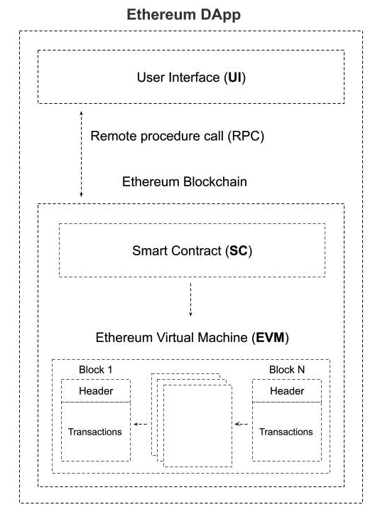

# Ethereum Backend Boilerplate
This starter repository can be used for building decentralized applications (dApp) on top of the Ethereum blockchain technology stack. It combines the latest bleeding-edge Ethereum development technologies and tools to accelerate the coding process with a modern and general approach.

You can also find an example of a dApp built using this boilerplate (branch `example`).

## Table of Contents
- [Ethereum dApp](#ethereum-dapp)
- [Folder Structure](#folder-structure)
- [Getting Started](#getting-started)
- [Tools](#tools)
    - [Prerequisities](#prerequisities)
    - [Usage](#usage)
- [Development Rules](#development-rules)
    - [Commit](#commit)
    - [Branch](#branch)
- [License](#license)

## Ethereum dApp
*DApp* (or *dApp*) is an abbreviated form for Decentralized Application. A dApp has its backend code running on a decentralized peer-to-peer network (e.g., Ethereum Blockchain). Contrast this with an app where the backend code runs on centralized servers (e.g., AWS, Node).

A DApp can have frontend code and user interfaces written in any language (e.g., React) that can make calls to its back end directly through RPC calls. Furthermore, its frontend can be hosted on decentralized storage (e.g., Swarm, IPFS).



## Folder Structure
* **`contracts`**: Contains the Solidity source files for Ethereum Smart Contracts written in Solidity language. This folder also contains an essential contract in here called Migrations.sol, which is used by Truffle to handle Smart Contracts deployment.
* **`migrations`**: Truffle uses a migration system to manage smart contract deployments. Migration is an additional particular smart contract that keeps track of changes. The Truffle configuration file is located inside the main project folder. 
* **`mocks`**: Contains the raw data necessary for Smart Contract storage initialization or testing (e.g., information about users or relevant object). The necessity of mocked data depends on the business logic of the Smart Contract itself. The raw data must be written in JSON format.
* **`scripts`**: Contains one or more JavaScript files used to call Smart Contract functionalities after the deploy phase. They can be used in combination with mock data to populate and execute Smart Contract logic.
* **`test`**: Contains every Smart Contracts functionality test. The tests are written in JavaScript and performed using Chai.

### Tools
* [web3js](https://github.com/ethereum/web3.js/): This is the Ethereum JavaScript API, which connects to the Generic JSON-RPC spec (offered by Ethereum node clients, like Geth) use to communicate with the blockchain nodes (i.e., call Smart Contracts methods, etc.). You need to run a local or remote Ethereum node to use this library. The backend is configured for both usages. 
**NB.** web3.js is not explicitly installed because Truffle provides a web3.js instance itself.
* [Truffle](https://github.com/trufflesuite/truffle): A world-class development environment, testing framework, and asset pipeline for blockchains using the Ethereum Virtual Machine (EVM), aiming to make life as a developer easier. It enables us to do the Smart Contract deploy, test, and so on!
* [Ganache](https://github.com/trufflesuite/ganache): A personal blockchain for Ethereum development you can use to deploy contracts, develop your applications, and run tests. It is available as both a desktop application and a command-line tool (formerly known as the TestRPC). Ganache is available for Windows, Mac, and Linux.
* [OpenZeppelin Contracts](https://openzeppelin.com/contracts/): This is a set of Smart Contracts standard libraries that help you minimize development risk for Ethereum and other blockchains. It includes the most used implementations of ERC standards (e.g., ERC20, ERC721, etc.).
* [OpenZeppelin TestHelpers](https://docs.openzeppelin.com/test-helpers/0.5/): Assertion library for Ethereum smart contract testing. It can be used to verify events, track balance changes, handle large numbers, check the transaction reverts, and much more.
* [Chai](https://www.chaijs.com/): Chai is a BDD / TDD assertion library for node and the browser written in JS. We will use the Should interface for testing purposes.

## Getting Started

### Prerequisities
You need to have the following installed:

* [git](https://git-scm.com/downloads) >= *2.21.0*
* [node](https://nodejs.org/en/download/) >= *10.15.3*
* [npm](https://www.npmjs.com/get-npm) >= *6.14.8*

### Usage
Clone the repo

```bash
git clone https://github.com/Innovation-Advisory-Links-Foundation/Ethereum-Backend-Boilerplate.git
```

Install node packages through npm.

```bash
cd Ethereum-Backend-Boilerplate
npm install
```

The npm scripts allow you to run a local development environment using Ganache or a remote development environment using the Ethereum Ropsten testnet. The scripts followed by `-dev` (e.g., `deploy-dev`) are used for the local usage, the other ones followed by `-net` (e.g., `deploy-net`) are used for the remote usage. The setup of the `.env` file change based on the environment.

##### Local Development Environment Usage
For the local development, the `.env` file is configured to run a local Ganache node on localhost on port **8545** with *10* different EOA accounts. Feel free to change the account and port number to match your needs. The mnemonic dev list of words can be maintained for local development to have the same accounts after each restart.

To start a local Ganache node, run the following script, which takes care of your configuration.

```bash
npm run ganache
```

To compile your Solidity Smart Contracts, run the following script. It will create a new folder `build/` which will contain your smart contracts ABI and other metadata.

```bash
npm run compile
```

To deploy locally on Ganache run.

```bash
npm run deploy-dev
```

To run a script locally run.

```bash
npm run script-dev
```

To run tests locally run.

```bash
npm run test-dev
```

##### Remote Development Environment Usage
For the remote development, the `.env` file is configured to using the Ethereum Ropsten testnet. To connect to Ropsten, we will use Infura. Inside the `.env` file, you need to specify the mnemonic set of words related to the wallet containing your testnet accounts and an Infura project identifier (register [here](https://infura.io/register) and follow this [steps](https://www.trufflesuite.com/tutorials/using-infura-custom-provider) to obtain the project identifier).

To compile your Solidity Smart Contracts, run the following script. It will create a new folder `build/` which will contain your smart contracts ABI and other metadata.

```bash
npm run compile
```

To deploy remotely on Ropsten run.

```bash
npm run deploy-net
```

To run a script that interacts with Ropsten run.

```bash
npm run script-net
```

To run tests on remote Smart Contracts run.

```bash
npm run test-net
```

##  Development Rules
Feel free to contribute following this Commit and Branch styling rules.

### Commit

See how a minor change to your commit message style can make you a better programmer.

Format: `<type>(<scope>): <subject>`

`<scope>` is optional

#### Example

```
feat: add hat wobble
^--^  ^------------^
|     |
|     +-> Summary in present tense.
|
+-------> Type: chore, docs, feat, fix, refactor, style, or test.
```

More Examples:

- `feat`: (new feature for the user, not a new feature for build script)
- `fix`: (bug fix for the user, not a fix to a build script)
- `docs`: (changes to the documentation)
- `style`: (formatting, missing semicolons, etc.; no production code change)
- `refactor`: (refactoring production code, e.g., renaming a variable)
- `test`: (adding missing tests, refactoring tests; no production code change)
- `chore`: (updating grunt tasks etc.; no production code change)

References:

- https://www.conventionalcommits.org/
- https://seesparkbox.com/foundry/semantic_commit_messages
- http://karma-runner.github.io/1.0/dev/git-commit-msg.html

### Branch

* The *master* branch must be used for releases only.
* There is a dev branch, used to merge all sub dev branch.
* Avoid long descriptive names for long-lived branches.
* No CamelCase.
* Use grouping tokens (words) at the beginning of your branch names (in a similar way to the `type` of commit).
* Define and use small lead tokens to differentiate branches in a meaningful way to your workflow.
* Use slashes to separate parts of your branch names.
* Remove branch after merge if it is not essential.

Examples:
    
    git branch -b docs/README
    git branch -b test/one-function
    git branch -b feat/side-bar
    git branch -b style/header

## License
This repository is released under the [MIT](https://github.com/Innovation-Advisory-Links-Foundation/Ethereum-Backend-Boilerplate/blob/master/LICENSE) License.

---
Ethereum Backend Boilerplate © 2020+, [LINKS Foundation](https://linksfoundation.com/)
